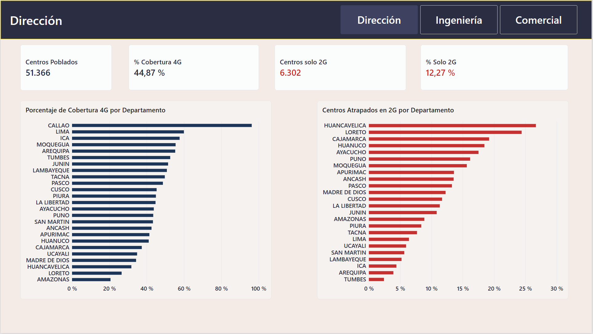
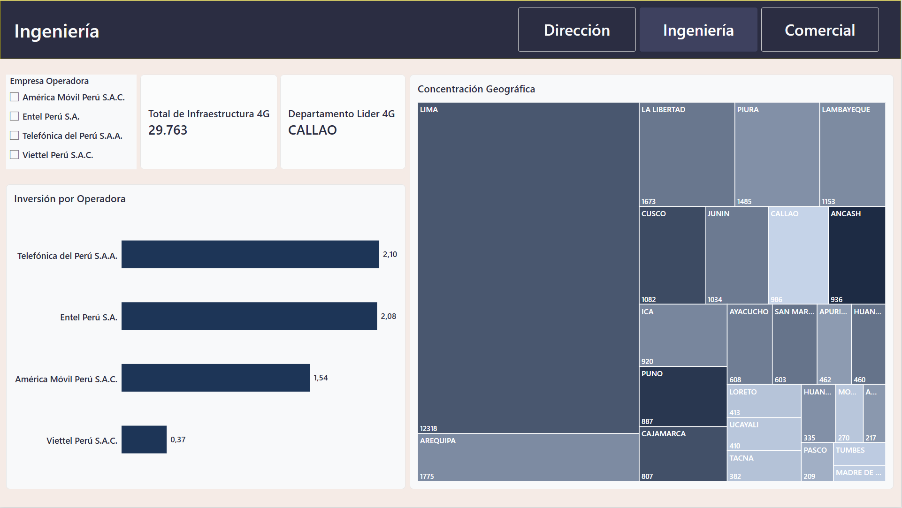
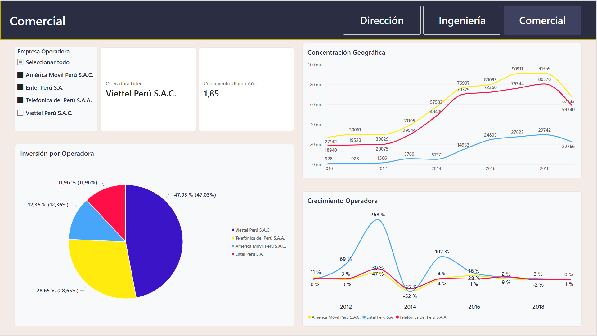

# Análisis de Cobertura Móvil en Perú — OSIPTEL

## Contexto

Análisis de la cobertura del servicio móvil a nivel de centros poblados en el Perú, usando datos oficiales de **OSIPTEL** (Organismo Supervisor de Inversión Privada en Telecomunicaciones). El proyecto combina una fotografía del estado actual de la red (marzo 2023) con la evolución histórica de cobertura por operadora entre 2010 y 2019, analizado primero en SQL puro y luego llevado a un dashboard interactivo en Power BI.

## Objetivo

Identificar la brecha digital por región, analizar la competencia entre las 4 operadoras móviles del país y evaluar la calidad de red disponible para la población peruana.

## Fuentes de datos

| Dataset | Descripción | Filas | Periodo |
|---|---|---|---|
| [Cobertura de Servicio Móvil por Empresa Operadora](https://www.datosabiertos.gob.pe/dataset/cobertura-de-servicio-m%C3%B3vil-por-empresa-operadora) | Detalle de tecnología (2G-5G), velocidad y estaciones base por centro poblado | 51,366 | Marzo 2023 |
| [Cantidad de Centros Poblados con Cobertura Móvil](https://www.datosabiertos.gob.pe/dataset/cantidad-de-centros-poblados-con-cobertura-m%C3%B3vil-osiptel) | Evolución trimestral de centros con cobertura por operadora | 97 | 2010 - 2019 |

## Herramientas

- PostgreSQL 16 + DBeaver — limpieza y análisis con SQL
- Power BI Desktop — modelado, DAX y visualización

## Estructura del proyecto

```
analisis-cobertura-movil-peru/
│
├── datos/
│   ├── raw/            ← CSVs originales sin modificar
│   └── procesados/     ← Resultados exportados como evidencia
│
├── sql/
│   ├── 01_crear_tablas.sql
│   ├── 02_cargar_datos.sql
│   ├── 03_limpieza.sql
│   └── 04_analisis.sql
│
├── powerbi/
│   ├── dashboard_cobertura_movil.pbix
│   └── capturas/
│       ├── pagina_direccion.png
│       ├── pagina_ingenieria.png
│       └── pagina_comercial.png
│
└── README.md
```

---

## Fase 1 — SQL: limpieza y análisis

### Problemas encontrados en los datos

El dataset principal llegó sorprendentemente limpio (sin nulos, sin coordenadas inválidas), pero surgieron varios problemas reales durante la carga y preparación:

- **Separador y codificación:** el CSV usa `;` como delimitador y codificación Latin-1, lo que corrompía tildes y ñ si no se especificaba explícitamente al importar.
- **Columnas numéricas mal tipadas por herramienta de importación:** una importación fallida generó columnas duplicadas (`2G`, `3G`, `4G`, `5G`) con los datos reales, mientras que las columnas destino (`tiene_2g`, `tiene_3g`...) quedaban en NULL. Se corrigió copiando los valores y eliminando las duplicadas.
- **Inconsistencia de mayúsculas/minúsculas en `departamento`:** el mismo departamento aparecía escrito de hasta 3 formas distintas (`Puno`, `PUNO`, incluso `ApurImac`). Se estandarizó todo a mayúsculas.
- **Campos de fecha como enteros:** `PERIODO` (202303) y `FECHA_CORTE` (20230613) venían como números sin formato de fecha. Se transformaron a tipo `DATE` real.
- **Tabla histórica con filas de encabezado y metadatos mezclados:** el Excel original traía un título y filas vacías antes de la cabecera real, que se colaron como registros al primer intento de carga.
- **Un solo periodo en el dataset principal (marzo 2023):** esto impidió el análisis de evolución temporal sobre esa tabla — se resolvió complementando con el dataset histórico (2010-2019) para cubrir ese ángulo.

### Hallazgos principales

**1. Brecha digital geográfica marcada por dificultad de acceso.** Huancavelica (26.7%) y Loreto (24.4%) tienen la mayor proporción de centros poblados atrapados solo en tecnología 2G, sin acceso a internet real — consistente con su geografía de sierra alta y selva profunda. Callao, en contraste, tiene 0% de centros solo en 2G y encabeza el índice de conectividad nacional.

**2. Viettel (Bitel) domina en presencia pero no en infraestructura por sitio.** Cubre el 47% de los registros del dataset —casi el doble que su competidor más cercano— y lidera en 24 de los 25 departamentos del país. Sin embargo, tiene el promedio más bajo de estaciones base 4G por centro poblado (0.37, frente a ~2.1 de Telefónica y Entel), lo que sugiere una estrategia de expansión geográfica rápida sobre densidad de infraestructura.

**3. Expansión histórica explosiva de Viettel en 2013-2014.** La operadora entró al mercado peruano en 2013 con apenas 2 centros poblados cubiertos y cerró 2014 con 11,510 — un crecimiento de +575,400% en un solo año, el evento más significativo de toda la serie histórica 2010-2019.

**4. Callao es el único departamento con competencia pareja entre operadoras.** A diferencia del resto del país donde Viettel domina claramente, en Callao Telefónica y Viettel están empatadas en cobertura 4G (7 centros cada una), y las otras dos operadoras también empatan entre sí en segundo lugar (6 centros).

**5. El índice de conectividad combinado (4G + velocidad) confirma el patrón geográfico.** Los 5 departamentos con mejor conectividad son todos costeros o de fácil acceso (Callao, Lima, Ica, Tumbes, Tacna); los 5 peores son de sierra o selva (Loreto, Huancavelica, Ucayali, Cajamarca, Amazonas).

**6. Ningún centro poblado del dataset carece por completo de cobertura.** Los 51,366 registros tienen al menos una tecnología de red activa (2G como mínimo) — la verdadera brecha no está en la ausencia total de señal sino en la calidad de la que sí existe.

### Archivos SQL

| Archivo | Contenido |
|---|---|
| `01_crear_tablas.sql` | Definición de la estructura de ambas tablas |
| `02_cargar_datos.sql` | Documentación del proceso de carga de datos crudos |
| `03_limpieza.sql` | Diagnóstico y corrección de calidad de datos |
| `04_analisis.sql` | 10 consultas de negocio organizadas en 4 bloques temáticos (brecha digital, competencia, calidad de red, evolución histórica) |

---

## Fase 2 — Power BI: dashboard interactivo

Como segunda etapa del proyecto, los mismos datos ya limpios en PostgreSQL se conectaron directamente a **Power BI** (sin migrar a otro motor de base de datos) para construir un dashboard interactivo de 3 páginas, cada una diseñada para una audiencia distinta dentro de una empresa de telecomunicaciones.

### Enfoque de diseño

En vez de un dashboard único que intenta mostrar todo a todos, se construyeron 3 vistas con propósitos diferenciados:

| Página | Audiencia | Enfoque |
|---|---|---|
| **Dirección** | Gerencia general | Panorama nacional en KPIs grandes: cobertura 4G y brecha en 2G por departamento |
| **Ingeniería** | Equipo técnico / expansión de red | Detalle de infraestructura: estaciones base por operadora y concentración geográfica |
| **Comercial** | Análisis de mercado y competencia | Participación de mercado, evolución histórica 2010-2019 y crecimiento interanual |

### Capturas

**Dirección**



**Ingeniería**



**Comercial**



### Medidas DAX destacadas

El modelo incluye medidas DAX desde agregaciones simples hasta patrones avanzados:

- **Cálculos base:** `Total Centros Poblados`, `Centros con 4G`, `Centros solo 2G`
- **Porcentajes con DIVIDE:** `% Cobertura 4G`, `% Solo 2G`, `Participación Operadora`
- **Búsqueda de valor máximo (TOPN + ALL):** `Departamento Líder 4G` y `Operadora Líder` — identifican dinámicamente el máximo sin necesidad de ordenar manualmente
- **Comparación temporal sin time intelligence nativo:** `Valor Año Anterior` y `Crecimiento % Histórico` — construidas con `CALCULATE` + `FILTER` + `ALL`, ya que la columna de año es un entero y no una fecha de calendario, lo que impide usar funciones como `SAMEPERIODLASTYEAR`

### Un problema real de modelado resuelto

Al construir la medida de crecimiento histórico, los resultados no coincidían con los cálculos ya validados en SQL (se obtenían porcentajes hasta 200 veces más altos de lo esperado). La causa: la tabla `cobertura_historica` tiene múltiples trimestres por año, y las medidas estaban sumando todos los trimestres en vez de tomar solo el más representativo (el mismo criterio de "último trimestre reportado" usado en la consulta SQL 4.1).

**Solución:** se creó una tabla calculada (`CobHist_TrimestreAlto`) usando `SUMMARIZE` + `ADDCOLUMNS` + `LOOKUPVALUE` para reducir la tabla a una fila por año-operadora antes de calcular el crecimiento — replicando en DAX la misma lógica que el CTE `trimestre_anio_alto` resolvía en SQL con `ROW_NUMBER()`.

### Nota sobre el modelo de datos

Las tablas `cobertura_movil` (nivel centro poblado, marzo 2023) y `cobertura_historica` / `CobHist_TrimestreAlto` (nivel nacional agregado, 2010-2019) se mantienen **sin relacionar** en el modelo, ya que representan niveles de granularidad distintos y no comparten una clave real. Relacionarlas artificialmente generaría resultados incorrectos por relaciones ambiguas — una decisión de modelado deliberada, no una limitación.

### Archivo

- `powerbi/dashboard_cobertura_movil.pbix`

---

## Limitaciones

- El dataset principal es una fotografía de un solo mes (marzo 2023); no permite ver tendencia reciente por sí solo.
- La serie histórica llega hasta 2019 — hay un vacío de datos públicos entre 2019 y 2023.
- Los datos representan lo reportado por las operadoras a OSIPTEL, no necesariamente el universo completo de centros poblados del Perú.

## Autor

Sebastián Mauricio — [LinkedIn](https://www.linkedin.com/in/sebastian-mauricio/) · [GitHub](https://github.com/SebastianMauricio322)
